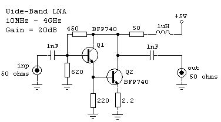
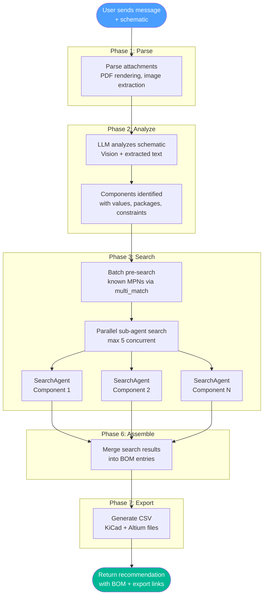
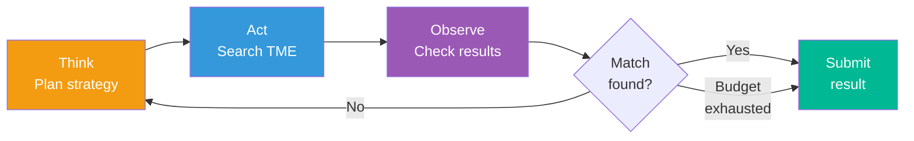
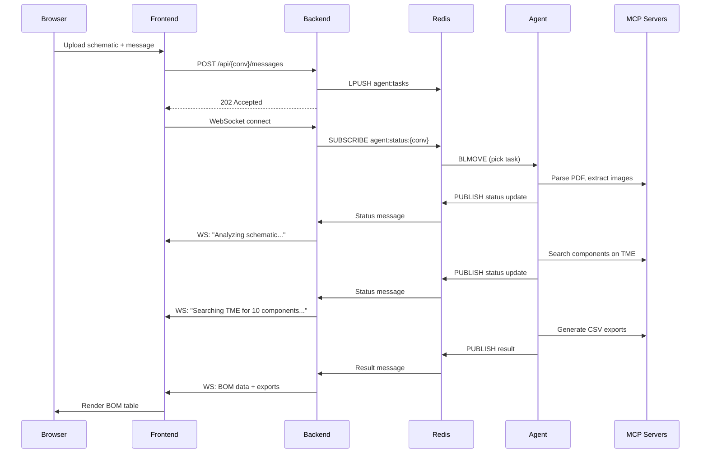
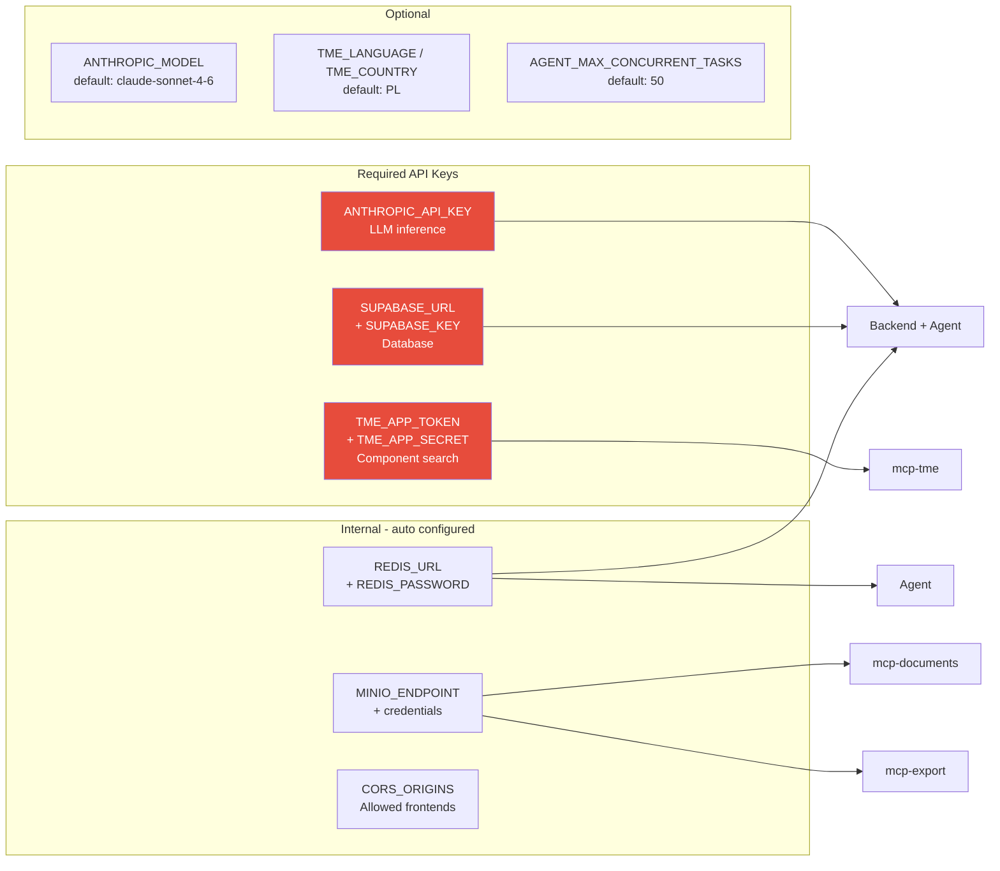

# Zane - AI Electronics Component Sourcing

Upload a schematic, describe what you need in natural language, and Zane finds real, purchasable components on TME with pricing and stock levels.



## What it does

You upload a schematic (PDF, photo, or hand-drawn sketch) and describe your requirements. Zane's AI agent:

1. **Analyzes** the schematic using computer vision (Claude)
2. **Identifies** all electronic components, values, packages, and constraints
3. **Searches** TME distributor API for real parts matching each spec
4. **Produces** a structured BOM with pricing, stock, distributor links
5. **Exports** downloadable CSV files for KiCad and Altium Designer

### Demo prompt

> Przygotuj liste elementow do miksera audio na podstawie dolaczonego pliku. Zastap tranzystory BC549 jakimis zamiennikami SMD, tak samo zastap uklad TDA2320 czyms tanszym. Rezystory maja miec rozmiar 0603, uzyj kondensatorow uznanych firm. Rozmiar bez znaczenia, ale do toru audio uzyj takich, ktorych dielektryk sie do tego nadaje. Kondensatory dobrze by bylo zeby byly SMD, ale nie musza byc. Priorytetyzuj niska cene przy 1000 sztuk calego urzadzenia. Liste komponentow dostosuj tak, aby mikser mial 8 kanalow. Znajdz jakies fajne gniazda jack 6,3mm do druku na wejscia i wyjscia. Potencjometry maja byc obrotowe, trwale i odporne na kurz.

The agent understands complex, multi-constraint requirements in any language, searches TME for each component, and returns a complete BOM optimized for your production volume.

---

## Architecture

### Microservices (Docker containers)

```mermaid
graph TB
    subgraph External
        Supabase[(Supabase<br/>PostgreSQL)]
        Anthropic[Anthropic API<br/>Claude]
        TME[TME API<br/>tme.eu]
    end

    subgraph Docker Network
        subgraph Core
            FE[Frontend<br/>Next.js :3000]
            BE[Backend<br/>FastAPI :8000]
            AG[Agent<br/>Orchestrator]
        end

        subgraph Infrastructure
            RD[(Redis 7<br/>:6379)]
            MO[(MinIO<br/>:9000)]
        end

        subgraph MCP Servers
            MTME[mcp-tme<br/>:8001]
            MDOC[mcp-documents<br/>:8003]
            MWS[mcp-websearch<br/>:8004]
            MEXP[mcp-export<br/>:8005]
        end

        subgraph Observability
            LK[Loki :3100]
            GF[Grafana :3001]
        end
    end

    FE -->|REST + WebSocket| BE
    BE -->|CRUD| Supabase
    BE -->|Files| MO
    BE -->|Task Queue + Pub/Sub| RD
    AG -->|BLMOVE / Pub/Sub| RD
    AG -->|SSE/HTTP| MTME
    AG -->|SSE/HTTP| MDOC
    AG -->|SSE/HTTP| MWS
    AG -->|SSE/HTTP| MEXP
    AG -->|LLM calls| Anthropic
    MTME -->|HMAC-SHA1| TME
    MDOC -->|Read/Write| MO
    MEXP -->|Write| MO
    MWS -->|web_search| Anthropic
    GF -->|Query| LK

    style FE fill:#1a1a2e,stroke:#4a9eff
    style BE fill:#1a1a2e,stroke:#4a9eff
    style AG fill:#1a1a2e,stroke:#e74c3c
    style RD fill:#1a1a2e,stroke:#d63031
    style MO fill:#1a1a2e,stroke:#00b894
```



### Agent workflow



### SearchAgent ReAct loop



### Task flow (Backend <-> Agent)



### Environment dependencies



---

## Quick start (local development)

```bash
git clone https://github.com/MrFishPL/zane.git && cd zane
cp .env.example .env
```

Fill in your API keys in `.env`:

| Variable | Where to get it |
|----------|----------------|
| `ANTHROPIC_API_KEY` | [console.anthropic.com](https://console.anthropic.com) |
| `TME_APP_TOKEN` + `TME_APP_SECRET` | [developers.tme.eu](https://developers.tme.eu) |
| `SUPABASE_URL` + `SUPABASE_KEY` | [supabase.com](https://supabase.com) |

Then start:

```bash
docker compose up --build
```

Open [http://localhost:3000](http://localhost:3000).

---

## Deploy to production

### Prerequisites

- A Linux server with SSH access
- Docker and Docker Compose installed (the deploy script auto-installs if missing)

### Option 1: GitHub Actions (automated)

Every push to `master` auto-deploys via GitHub Actions.

**Setup (one-time):**

```bash
# Set deployment secrets
gh secret set DEPLOY_HOST -b "your-server-ip"
gh secret set DEPLOY_USER -b "root"
gh secret set DEPLOY_PASSWORD -b "your-ssh-password"

# Set the .env file as a secret (contains all API keys)
gh secret set DOTENV < .env
```

Push to `master` and the workflow deploys automatically:
- Clones/pulls the repo to `/opt/zane` on the server
- Writes `.env` from the `DOTENV` secret
- Runs `docker compose up --build -d`

### Option 2: Manual deployment

```bash
# On your server
git clone https://github.com/MrFishPL/zane.git /opt/zane
cd /opt/zane

# Create .env with your API keys
cp .env.example .env
nano .env

# Add your server IP to CORS_ORIGINS
# CORS_ORIGINS=http://localhost:3000,http://YOUR_SERVER_IP:3000

# Build and start
docker compose up --build -d

# Check status
docker compose ps
```

### Post-deploy checklist

- [ ] Set `CORS_ORIGINS` in `.env` to include your server's public URL
- [ ] Change `REDIS_PASSWORD` from the default
- [ ] Change `MINIO_ROOT_USER` / `MINIO_ROOT_PASSWORD` from defaults
- [ ] Verify all containers are healthy: `docker compose ps`
- [ ] Test the frontend at `http://YOUR_SERVER_IP:3000`
- [ ] (Optional) Set up HTTPS with a reverse proxy (nginx/Caddy) in front of ports 3000 and 8000

### Updating

```bash
cd /opt/zane
git pull origin master
docker compose up --build -d
```

Or just push to `master` if GitHub Actions is configured.

---

## Development

```bash
# Run all services
docker compose up --build

# Run a single service
docker compose up --build backend

# Follow logs
docker compose logs -f agent

# Run Python tests
cd backend && pip install -r requirements.txt && pytest
cd agent && pip install -r requirements.txt && pytest

# Run frontend tests
cd frontend && npm install && npm test
```

### Observability

- **Grafana**: [http://localhost:3001](http://localhost:3001) (admin/admin)
- **Loki logs**: Accessible through Grafana dashboards
- **MinIO Console**: [http://localhost:9001](http://localhost:9001)

To enable Docker log shipping to Loki:

```bash
# Install the Loki Docker driver (one-time)
docker plugin install grafana/loki-docker-driver:latest --alias loki --grant-all-permissions

# Start with Loki logging overlay
docker compose -f docker-compose.yml -f docker-compose.override.loki.yml up -d
```

---

## External services

| Service | Purpose | Sign up |
|---------|---------|---------|
| **Anthropic API** | Claude LLM for vision + reasoning | [console.anthropic.com](https://console.anthropic.com) |
| **TME API** | Electronic component search, pricing, stock | [developers.tme.eu](https://developers.tme.eu) |
| **Supabase** | PostgreSQL database (conversations, messages) | [supabase.com](https://supabase.com) |

## License

Private repository.
